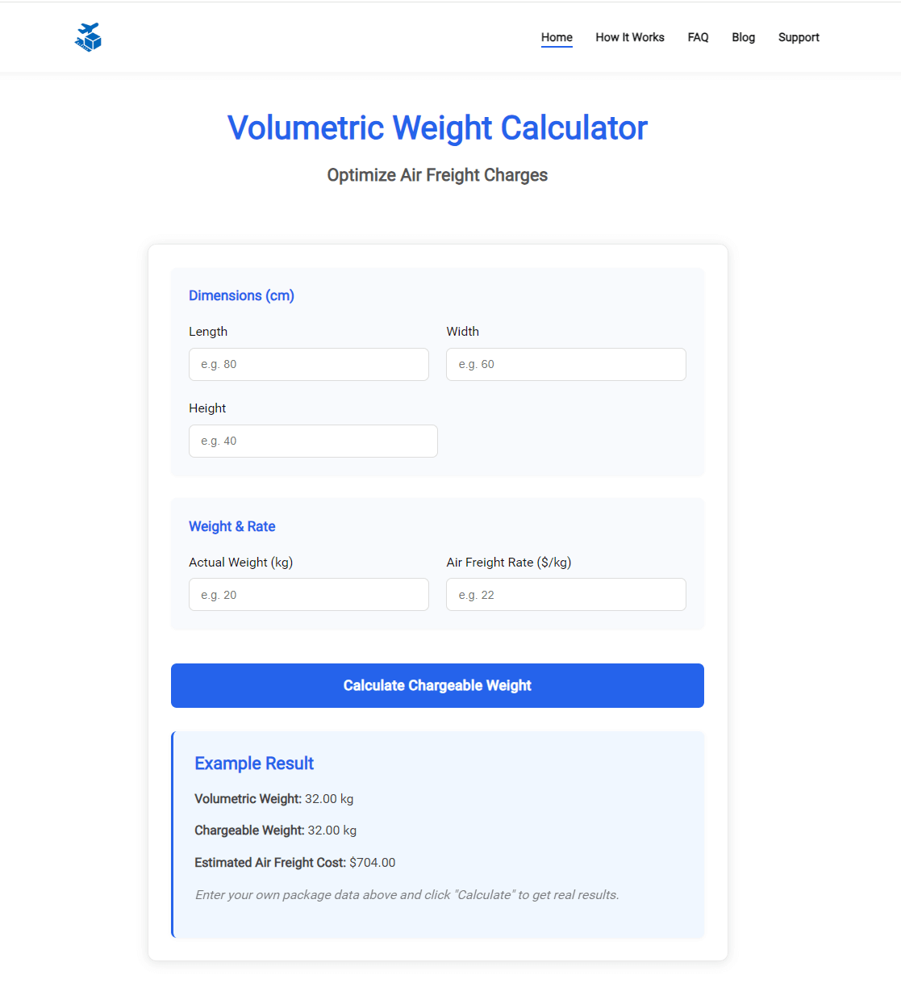

# ✈️ Volumetric Weight Calculator – Optimize Air Freight Charges

> Easily calculate chargeable weight and optimize your air freight costs  
> 💼 Ideal for logistics professionals, exporters, and e-commerce sellers

[👉 Visit the Live Tool](https://www.volumetricweightcalculator.com)

---

## 📷 Screenshot

---

## 🔍 What is Volumetric Weight Calculator?

**Volumetric Weight Calculator** helps you calculate the **chargeable weight** of your air cargo using the standard formula:

> **(Length × Width × Height) ÷ 6000**

This tool is ideal for detecting **low-density cargo**, **avoiding overcharges**, and **planning cost-efficient shipments**.

---

## ✨ Key Features

- 📦 Input dimensions in cm (L × W × H)
- ⚖️ Get instant volumetric weight results
- ✈️ Compares actual vs. volumetric weight
- 🛠️ Works on all devices (mobile-friendly)
- 🌍 Supports global air freight standards
- 🆓 100% free to use, no signup required

---

## 💻 Tech Stack

- HTML / CSS / JavaScript  
- Hosted via [Vercel](https://vercel.com)  
- Managed with [GitHub](https://github.com)

---

## 📈 SEO Optimized

- Fast-loading and clean UI  
- Meta title & description configured  
- JSON-LD structured data included  
- Sitemap & robots.txt ready

---

## 🗂️ License

This repository is for **showcase purposes only**.  
The project source code is **private**.

Visit the live tool here:  
👉 [https://www.volumetricweightcalculator.com](https://www.volumetricweightcalculator.com)
